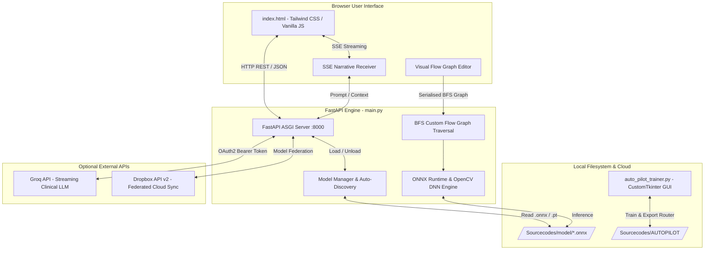

# SmiloAI Engine v5.0 — Offline-First, Dual-Modality Dental AI Diagnostic Workstation

[](https://opensource.org/licenses/MIT)
[](https://www.python.org/downloads/)
[](https://fastapi.tiangolo.com)
[](https://onnxruntime.ai/)
[](https://ultralytics.com)
[](https://github.com/TomSchimansky/CustomTkinter)

---

## 🌟 Overview

**SmiloAI Engine v5.0** is a state-of-the-art, local-first dental diagnostic workstation designed for dental clinicians, researchers, and AI engineers. Evolving significantly from early alpha prototypes, v5.0 provides real-time, high-precision computer vision inference across both **Intraoral RGB Photographs** and **Radiographic Dental X-Rays**.

Built on a decoupled modern architecture combining a **FastAPI backend engine (`main.py`)**, an interactive **Tailwind CSS / Vanilla JS frontend (`index.html`)**, and a dedicated **CustomTkinter PyTorch training suite (`auto_pilot_trainer.py`)**, SmiloAI delivers clinical-grade diagnostic insights without requiring cloud inference or compromising patient privacy.

---

## 🧠 Core AI Specialist Models & Confidence Architecture

SmiloAI v5.0 introduces an automated, modular model management architecture. Models are loaded directly from the local filesystem (`/Sourcecodes/model/`) into memory via **ONNX Runtime** and **Ultralytics YOLOv8**, optimized for CPU inference with AVX2 instruction acceleration.

### 📦 Bundled & Supported Specialist Models

| Model Filename | Diagnostic Specialty | Modality | Benchmark Confidence / Accuracy | Description |
| :--- | :--- | :--- | :--- | :--- |
| `CALCULUSMD_R_60.onnx` | **Dental Calculus & Tartar** | `RGB` (Intraoral Photo) | **60% (`R_60`)** top-1 mAP | Detects mineralized plaque (calculus/tartar) build-up along gum lines and interproximal tooth surfaces. |
| `CARIESMD_XR_95.onnx` *(Example)* | **Dental Caries (Cavities)** | `X-Ray` (Radiograph) | **95% (`XR_95`)** top-1 mAP | Identifies enamel erosion, dentin decay, and interproximal cavities on bitewing/periapical radiographs. |
| `GINGIVITISMD_R_85.onnx` *(Example)* | **Gingival Inflammation** | `RGB` (Intraoral Photo) | **85% (`R_85`)** top-1 mAP | Segments gingival margins and analyzes marginal redness/swelling to detect periodontal inflammation. |

### 🔍 Automated Model Naming & Discovery Protocol

SmiloAI uses an intelligent filename parsing system that automatically registers models, categorizes modalities, and extracts validation scores without code modifications.

When any model file (`.onnx` or `.pt`) is placed in the model directory, the engine parses it according to the standard convention:
```
{DiagnosticName}MD_{ModalityCode}_{ConfidenceScore}.{Extension}
```
- **Diagnostic Name**: Identifies the pathology (e.g., `CALCULUS`, `CARIES`, `PERIO`). The trailing `MD` designates a Medical Diagnostic specialist.
- **Modality Code**:
  - `_R_`: **RGB** Intraoral Photograph specialist.
  - `_XR_`: **X-Ray** Radiographic specialist.
- **Confidence / Accuracy Score**: The numerical benchmark score (e.g., `60` representing 60% validation accuracy). This score is automatically extracted and displayed as an accuracy badge in the UI Model Manager.

---

## ✈️ Auto-Pilot Smart Routing Engine

A breakthrough feature in SmiloAI v5.0 is the **Auto-Pilot Smart Router**—a self-training classification pipeline that dynamically inspects incoming patient scans and routes them to the optimal custom diagnostic workflow automatically.

### 🎯 How Smart Routing Works
1. When **Auto-Pilot Mode** is enabled in the UI, uploaded images bypass manual model selection.
2. The scan is evaluated by the active router model located in `/Sourcecodes/AUTOPILOT/AUTOPILOT_MODELS/`.
3. The router predicts the exact diagnostic flow preset required for the scan (e.g., routing an X-ray to a multi-stage *Endodontic Assessment Flow* versus an RGB image to a *Hygiene & Tartar Flow*).

### 🛠️ Built-In Desktop Training Suite (`auto_pilot_trainer.py`)
SmiloAI includes an integrated desktop training application built with **CustomTkinter**, **PyTorch**, and **Matplotlib**. Clinicians and engineers can train new routing models directly on their workstation:
- **Balanced Data Sampling**: Automatically samples training images equally into balanced datasets.
- **Real-Time Telemetry**: Renders live Top-1 Accuracy and Training Loss graphs per epoch.
- **Automated ONNX Export**: On completion, saves best checkpoints converted to optimized 224×224 ONNX format with timestamped accuracy signatures:
  ```
  AUTOPILOT_{accuracy}_{YYYYMMDD_HHMMSS}.onnx
  ```
  *(Example: `AUTOPILOT_87_20250301_143022.onnx` represents a newly trained router achieving 87% routing accuracy).*

---

## 🩺 Dual-Modality Diagnostic Capabilities

SmiloAI v5.0 bridges the gap between visual examinations and internal structural diagnostics by seamlessly supporting dual imaging modalities:

### 📸 Intraoral RGB Photography (`RGB`)
- **Tooth Decay & Cavities**: Discoloration tracking, dark fissure analysis, and surface cavitation detection.
- **Plaque & Calculus Deposits**: Edge-detection and contrast differentiation identifying yellowish/calcified tartar along gingival margins.
- **Gingivitis & Soft Tissue Inflammation**: Color-space normalization measuring gingival redness, swelling, and bleeding markers.
- **Orthodontic & Alignment Tracking**: Geometric feature mapping for tooth crowding and spacing irregularities.

### 🩻 Radiographic X-Ray Analysis (`X-Ray`)
- **Sub-Surface Caries**: Interproximal and recurrent decay detection beneath existing restorations.
- **Periodontal Bone Loss**: Alveolar crest level evaluation and horizontal/vertical defect identification.
- **Periapical & Endodontic Lesions**: Radiolucency detection around root apices indicating infection or abscesses.

---

## ⚡ Advanced Inference Pipelines & Flow Builder

SmiloAI provides flexible inference execution modes tailored for different clinical workflows:

1. **Single & Batch Scan Mode**: Real-time screening of individual patient photos or high-throughput batch processing with token/resource safeguards.
2. **Sequential Specialist Mode**: Chains multiple specialist models sequentially, running exhaustive multi-model screenings across all loaded RGB or X-Ray detectors.
3. **Custom Flow Graph Editor**:
   - An interactive visual node-wiring canvas inside the browser.
   - Clinicians can drag and drop specialist model nodes, conditional gates, and output formatters, wiring them together into custom diagnostic graphs.
   - Uses a **Breadth-First Search (BFS)** graph traversal engine in `main.py` to execute complex conditional diagnostic logic.
   - Flow setups can be saved as persistent presets in LocalStorage and linked directly to the Auto-Pilot routing engine.

---

## 🎛️ Confidence Thresholding & IoU NMS Filtering

To ensure diagnostic precision and eliminate false positives, SmiloAI incorporates robust post-processing algorithms:

- **Dynamic Confidence Control (`conf_threshold`)**: A real-time UI slider (defaulting to `0.25` / 25%) allows clinicians to dynamically calibrate model sensitivity on the fly without re-running inference.
- **IoU-Based Non-Maximum Suppression (NMS)**: When multiple specialist models analyze the same scan, duplicate bounding boxes are eliminated using a custom Intersection over Union (IoU) threshold of `0.4`. Only the highest-confidence prediction for overlapping lesions is retained, ensuring clean HUD annotations.

---

## 🎨 Heads-Up Display (HUD) & Clinical Reporting

SmiloAI generates rich visual diagnostics using advanced image compositing:
- **Luminance Halo Annotations**: Bounding boxes and callout labels are rendered using Pillow (PIL) and OpenCV, featuring soft Gaussian-blurred glow layers that ensure readability against any tooth or tissue shade.
- **Exportable Diagnostic Reports**: Clinicians can download annotated JPEG scans or generate comprehensive HTML clinical diagnostic reports directly from the interface for patient records.

---

## 🤖 AI Clinical Assistant (Groq LLM Integration)

SmiloAI goes beyond bounding boxes by integrating an optional **AI Clinical Assistant** powered by Groq's high-speed streaming LLM API:
- **Server-Sent Events (SSE) Streaming**: Connects via `/generate_ai_summary_stream` to deliver token-by-token real-time narrative summaries.
- **Context-Aware Translation**: Translates technical bounding box coordinates and detection counts into empathetic, patient-friendly clinical treatment explanations (e.g., detailing standard drilling and filling procedures for caries, or ultrasonic scaling for calculus).
- *Note*: The AI Assistant operates strictly with plain readable text without markdown clutter, optimized for clinical consultation.

---

## 🏗️ System Architecture



---

## 🚀 Installation & Setup Guide

### 📋 System Requirements
- **Operating System**: Windows 10/11 (64-bit), Linux, or macOS.
- **Processor**: Intel Core i5 6th Gen / AMD Ryzen 3 or newer (**AVX2 instruction support required** for ONNX CPU inference).
- **RAM**: 8 GB minimum (16 GB recommended when loading multiple specialist models simultaneously).
- **Python**: Python 3.10 or newer.

### ⚡ Quick Start (Developer Setup)

1. **Clone the Repository**:
   ```bash
   git clone https://github.com/nimo94/SmiloAI.git
   cd SmiloAI
   ```

2. **Configure Environment Variables**:
   Copy the example environment file and insert your optional API keys (for Groq LLM clinical summaries or Dropbox cloud federation):
   ```bash
   cp .env.example .env
   # Edit .env with your favorite text editor
   ```

3. **Create & Activate Virtual Environment**:
   ```bash
   python3 -m venv .venv
   # On Linux / macOS:
   source .venv/bin/activate
   # On Windows:
   .venv\Scripts\activate
   ```

4. **Install Required Dependencies**:
   ```bash
   pip install --upgrade pip
   pip install fastapi uvicorn opencv-python ultralytics torch torchvision pillow numpy dropbox groq requests customtkinter matplotlib pandas
   ```

5. **Launch SmiloAI Workstation**:
   Navigate to the source directory and start the engine:
   ```bash
   cd Sourcecodes
   python main.py
   ```
   *The FastAPI server will initialize on `http://127.0.0.1:8000` and automatically open your default web browser to the SmiloAI workstation interface!*

---

## 🔒 Security & Privacy Notice

SmiloAI v5.0 is designed from the ground up as an **offline-first medical workstation**:
- **Zero Data Exfiltration**: Patient photographs and X-ray scans processed during standard inference are processed entirely locally in your machine's system memory. No image data is transmitted to external servers.
- **Optional Cloud Features**: External network communication only occurs if you explicitly configure and trigger optional features:
  - **Groq API**: Transmits only anonymized detection summaries (class labels and counts, **never images**) to generate clinical narratives.
  - **Dropbox Sync**: Transmits only model checkpoint files during remote model synchronization.
- **Secret Protection**: All API keys and authentication tokens must be configured via environment variables (`.env`). Hardcoded secrets are strictly forbidden by repository security policies.

---

## 📁 Repository Structure

```
SmiloAI/
├── README.md                           # Comprehensive Technical Documentation (This File)
├── LICENSE                             # MIT License
├── .env.example                        # Example Environment Variables Template
├── .gitignore                          # Security & Cleanup Ignore Rules
├── SmiloAi_v5_Documentation.docx       # Full Technical FYP Documentation
└── Sourcecodes/                        # Main Application Source Code
    ├── main.py                         # FastAPI Backend & Inference Engine
    ├── index.html                      # Tailwind CSS & Vanilla JS Workstation UI
    ├── trainer.py                      # CustomTkinter Training UI Module
    ├── auto_pilot_trainer.py           # Standalone Auto-Pilot Router Training Suite
    ├── logo.png                        # Application Brand Assets
    ├── model/                          # Specialist Diagnostic Models Directory
    │   └── CALCULUSMD_R_60.onnx        # Bundled Calculus RGB Specialist (60% ACC)
    └── AUTOPILOT/                      # Auto-Pilot Router Engine Directory
        ├── auto_pilot_trainer.py       # Trainer Subprocess Entrypoint
        ├── Training_Data/              # Balanced Image Sampling Storage
        └── AUTOPILOT_MODELS/           # Trained Router ONNX Checkpoints
```

---

## ⚠️ Clinical Disclaimer

SmiloAI is engineered as an advanced AI-assisted supplementary screening tool for educational, diagnostic research, and oral health awareness purposes. **It is not a substitute for professional clinical judgment, formal radiological diagnosis, or specialized dental examinations.** All diagnostic findings should be verified by a qualified dental surgeon prior to initiating clinical treatment.

---

## 📄 License & Author

This project is licensed under the **MIT License** — see the [LICENSE](LICENSE) file for details.

**Copyright (c) 2025–2026 Aswindra Selvam**  
*SmiloAI v5.0 — Final Year Project Technical Submission*
