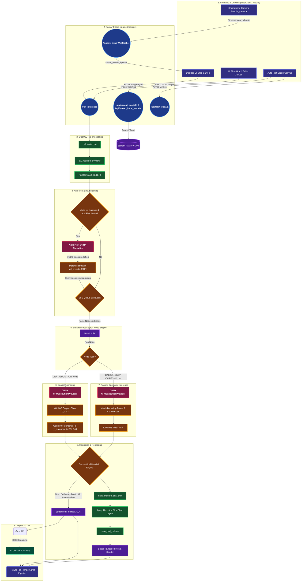

# SmiloAI Engine v6.1 — Offline-First, Dual-Modality Dental AI Diagnostic Workstation

<p align="center">
  
</p>

<p align="center">
  <a href="https://opensource.org/licenses/MIT"></a>
  <a href="https://www.python.org/downloads/"></a>
  <a href="https://fastapi.tiangolo.com"></a>
  <a href="https://onnxruntime.ai/"></a>
  <a href="https://ultralytics.com"></a>
</p>

> **🚀 UPCOMING UPDATE:** Fully compiled, zero-dependency **Standalone Packages for Linux and Windows** (.exe / .AppImage) are currently in development for a 1-click install experience.

---

## 🌟 Overview (What's New in v6.1)

**SmiloAI Engine v6.1** introduces the integrated **Auto Pilot Studio**, allowing practitioners to train their own custom AI routing models directly within the unified liquid-glass interface. It builds upon v6.0's massive leap forward in security, user experience, and clinical reporting, transforming the engine into a polished, standalone Desktop Application.

### 📊 v6.0 vs v6.1 Comparison

| Feature | SmiloAI v6.0 | SmiloAI v6.1 |
| :--- | :--- | :--- |
| **Auto Pilot Trainer** | Disconnected standalone desktop script | **Integrated Liquid Glass Studio** inside the main UI |
| **VRAM Management** | Diagnostic models permanently locked in memory | **Dynamic Model Unloading/Reloading** to maximize training RAM |
| **Training Feedback** | Basic terminal console log | **Live Animated Accuracy HUD** with dynamic color scaling |
| **Model Completion UI**| Standard browser popups | **Glassmorphic ambient-glowing** success modals |
| **YOLO ONNX Export** | Prone to `amax()` NMS runtime crashes | **Hardened `classify` Task Override** for stable routing |
| **System State Syncing**| Race conditions during rapid UI transitions | **Strict Async Handlers** (`requireFlowLabelAsync`) for seamless UX |

### 🔥 Detailed v6.1 Upgrades:
- **Auto Pilot Studio Integration**: Wove the SmiloAI Auto Pilot functionality directly into the main interface using a sleek, premium "Extreme Liquid Glass" modal design, replacing separate scripts with a unified experience.
- **Dynamic VRAM Management**: Auto Pilot Studio now automatically unloads all inference models from memory when opened, ensuring maximum VRAM/RAM is available for custom AI model training, and seamlessly reloads the system models upon exit without requiring a hard server restart.
- **Real-Time Accuracy HUD**: Added a massive, beautifully animated real-time accuracy display that dynamically swells and flashes emerald or rose depending on epoch-to-epoch performance during training.
- **Glassmorphic Success Feedback**: Completely removed standard browser alerts in favor of an elegant, ambient-glowing completion modal that presents final training metrics and the exported `.onnx` matrix to the user upon success.
- **YOLO Inference Engine Crashes**: Deep-patched the Ultralytics instantiation to explicitly enforce `task='classify'` during ONNX model loading and exporting, permanently preventing `IndexError: amax()` NMS crashes when analyzing Auto Pilot routing models.
- **Async State Race Conditions**: Fixed the `getActiveFlowLabel` ReferenceError by replacing it with a custom `requireFlowLabelAsync` function that elegantly handles the new glass modal UI asynchronous flow.

---

## 🧠 Core AI Specialist Models & Confidence Architecture

SmiloAI v6.1 retains its automated, modular model management architecture. Models are loaded directly from the local filesystem (`/Sourcecodes/model/`) into memory via **ONNX Runtime** and **Ultralytics YOLOv8**, optimized for CPU inference with AVX2 instruction acceleration.

### 📦 Bundled & Supported Specialist Models

| Model Filename | Diagnostic Specialty | Modality | Benchmark Confidence / Accuracy | Description |
| :--- | :--- | :--- | :--- | :--- |
| `CALCULUSMD_R_60.onnx` | **Dental Calculus & Tartar** | `RGB` (Intraoral Photo) | **60% (`R_60`)** top-1 mAP | Detects mineralized plaque (calculus/tartar) build-up along gum lines and interproximal tooth surfaces. |
| `CARIESMD_XR_95.onnx` *(Example)* | **Dental Caries (Cavities)** | `X-Ray` (Radiograph) | **95% (`XR_95`)** top-1 mAP | Identifies enamel erosion, dentin decay, and interproximal cavities on bitewing/periapical radiographs. |
| `GINGIVITISMD_R_85.onnx` *(Example)* | **Gingival Inflammation** | `RGB` (Intraoral Photo) | **85% (`R_85`)** top-1 mAP | Segments gingival margins and analyzes marginal redness/swelling to detect periodontal inflammation. |
| `DENTALPOSITION_R_98.onnx` | **Anatomical Mapping** | `RGB` (Intraoral Photo) | **98% (`R_98`)** top-1 mAP | Specifically identifies tooth locations (e.g. Central Incisor, Molar) to provide spatial context for clinical reports. |

### 🔍 Automated Model Naming & Discovery Protocol

When any model file (`.onnx` or `.pt`) is placed in the model directory, the engine parses it according to the standard convention:
```
{DiagnosticName}MD_{ModalityCode}_{ConfidenceScore}.{Extension}
```
- **Diagnostic Name**: Identifies the pathology. The trailing `MD` designates a Medical Diagnostic specialist.
- **Modality Code**: `_R_` (RGB) or `_XR_` (X-Ray).
- **Confidence / Accuracy Score**: The numerical benchmark score automatically displayed in the UI Model Manager.

---

## ✈️ Auto-Pilot Smart Routing Engine

A breakthrough feature in SmiloAI is the **Auto-Pilot Smart Router**—a self-training classification pipeline that dynamically inspects incoming patient scans and routes them to the optimal custom diagnostic workflow automatically.

### 🛠️ Built-In Desktop Training Suite (`auto_pilot_trainer.py`)
SmiloAI includes an integrated desktop training application built with **CustomTkinter**, **PyTorch**, and **Matplotlib**. Clinicians and engineers can train new routing models directly on their workstation, exporting them as ONNX format (`AUTOPILOT_{accuracy}_{YYYYMMDD_HHMMSS}.onnx`).

---

## 🩺 Dual-Modality Diagnostic Capabilities

### 📸 Intraoral RGB Photography (`RGB`)
- **Tooth Decay & Cavities**: Discoloration tracking and surface cavitation detection.
- **Plaque & Calculus Deposits**: Edge-detection for mineralized tartar along gingival margins.
- **Gingivitis & Soft Tissue**: Color-space normalization for gingival redness and inflammation.

### 🩻 Radiographic X-Ray Analysis (`X-Ray`)
- **Sub-Surface Caries**: Interproximal and recurrent decay detection.
- **Periodontal Bone Loss**: Alveolar crest level evaluation.
- **Periapical Lesions**: Radiolucency detection around root apices indicating infection.

---

## ⚡ Advanced Inference Pipelines & Flow Builder

SmiloAI provides flexible inference execution modes tailored for different clinical workflows:
1. **Single & Batch Scan Mode**: Real-time screening of individual patient photos or high-throughput batch processing.
2. **Sequential Specialist Mode**: Chains multiple specialist models sequentially.
3. **Custom Flow Graph Editor**: An interactive visual node-wiring canvas to build custom diagnostic pipelines utilizing a Breadth-First Search (BFS) graph traversal engine.

---

## 🎛️ Confidence Thresholding & IoU NMS Filtering

- **Dynamic Confidence Control (`conf_threshold`)**: A real-time UI slider (defaulting to `0.25`) to calibrate model sensitivity.
- **IoU-Based Non-Maximum Suppression (NMS)**: Eliminates duplicate bounding boxes across multiple models using an IoU threshold of `0.4`.

---

## 🎨 Heads-Up Display (HUD) & Clinical Reporting

SmiloAI generates rich visual diagnostics:
- **Luminance Halo Annotations**: Bounding boxes with soft Gaussian-blurred glow layers for universal readability.
- **Comprehensive PDF Reports (New in v6)**: A completely redesigned HTML-to-PDF export pipeline utilizing Universal and FDI numbering systems, organized spatial mapping, and highly-detailed crop analyses for clinical documentation.

---

## 🤖 AI Clinical Assistant (LLM Integration)

SmiloAI integrates an optional **AI Clinical Assistant** powered by a high-speed streaming LLM API:
- **Server-Sent Events (SSE) Streaming**: Delivers token-by-token real-time narrative summaries via `/generate_ai_summary_stream`.
- **Context-Aware Translation**: Translates technical bounding box coordinates into empathetic, patient-friendly clinical treatment explanations.

---

## 🔄 The SmiloAI Diagnostic Workflow (How It Works)

The SmiloAI ecosystem operates as a highly interconnected, offline-first pipeline. Below is the step-by-step diagnostic journey of a clinical image from capture to final PDF report:


```mermaid
graph TD
    %% Styling Configuration
    classDef sys fill:#0f172a,stroke:#3b82f6,stroke-width:2px,color:#f8fafc
    classDef api fill:#1e3a8a,stroke:#60a5fa,stroke-width:2px,color:#ffffff,font-weight:bold
    classDef memory fill:#4c1d95,stroke:#a855f7,stroke-width:2px,color:#ffffff
    classDef cv2 fill:#14532d,stroke:#22c55e,stroke-width:2px,color:#ffffff
    classDef onnx fill:#831843,stroke:#f43f5e,stroke-width:2px,color:#ffffff,font-weight:bold
    classDef logic fill:#78350f,stroke:#f59e0b,stroke-width:2px,color:#ffffff
    classDef llm fill:#064e3b,stroke:#34d399,stroke-width:2px,color:#ffffff
    classDef ui fill:#312e81,stroke:#818cf8,stroke-width:2px,color:#ffffff
    
    subgraph ClientLayer["1. Frontend & Devices (index.html / Mobile)"]
        UI_DragDrop[Desktop UI Drag & Drop]:::ui
        UI_Graph[UI Flow Graph Editor Canvas]:::ui
        UI_Studio[Auto Pilot Studio Canvas]:::ui
        Mob_Cam[Smartphone Camera /mobile_camera]:::ui
    end

    subgraph ServerLayer["2. FastAPI Core Engine (main.py)"]
        API_Train(("/api/train_stream")):::api
        API_Mem(("/api/unload_models & /api/reload_local_models")):::api
        API_Sync(("/mobile_sync WebSocket")):::api
        API_Inf(("/run_inference")):::api
    end
    
    %% Interactions
    UI_Studio -->|Trigger Training| API_Mem
    API_Mem -->|Frees VRAM| RAM[(System RAM / VRAM)]:::memory
    UI_Studio -->|Async Metrics| API_Train
    
    Mob_Cam -->|Streams binary chunks| API_Sync
    API_Sync -->|check_mobile_upload| UI_DragDrop
    
    UI_DragDrop -->|POST Image Bytes| API_Inf
    UI_Graph -->|POST JSON Graph| API_Inf
    
    subgraph Preprocess["3. OpenCV Pre-Processing"]
        API_Inf --> CV1[cv2.imdecode]:::cv2
        CV1 --> CV2[cv2.resize to 640x640]:::cv2
        CV2 --> CV3[Pad Canvas 640x1140]:::cv2
    end
    
    subgraph Router["4. Auto Pilot Smart Routing"]
        CV3 --> AP1{Mode == 'custom' & AutoPilot Active?}:::logic
        AP1 -->|Yes| AP2(Auto Pilot ONNX Classifier):::onnx
        AP2 -->|YOLO class prediction| AP3[Matches string in all_presets JSON]:::logic
        AP3 -->|Overrides execution graph| BFS
        AP1 -->|No| BFS
    end
    
    subgraph BFS_Engine["5. Breadth-First Search Node Engine"]
        BFS{BFS Queue Execution}:::logic
        BFS -->|Parse Nodes & Edges| Q[queue = list]:::memory
        Q -->|Pop Node| N1{Node Type?}:::logic
    end
    
    subgraph Spatial["6. Spatial Anchoring"]
        N1 -->|'DENTALPOSITION' Node| DP1(ONNX CPUExecutionProvider):::onnx
        DP1 --> DP2[YOLOv8 Output: Class 0,1,2,3]:::logic
        DP2 --> DP3[Geometric Centers x_c, y_c mapped to FDI Grid]:::logic
    end
    
    subgraph Specialist["7. Parallel Specialist Inference"]
        N1 -->|'CALCULUSMD', 'CARIESMD', etc| SP1(ONNX CPUExecutionProvider):::onnx
        SP1 --> SP2[Yields Bounding Boxes & Confidences]:::logic
        SP2 --> IOU[IoU NMS Filter > 0.4]:::logic
    end
    
    subgraph Synthesis["8. Heuristics & Rendering"]
        DP3 --> HEUR
        IOU --> HEUR
        HEUR{Geometrical Heuristic Engine}:::logic
        HEUR -->|Links Pathology box inside Anatomy box| JSON_RES[Structured Findings JSON]:::memory
        
        HEUR --> DRAW1[draw_modern_box_only]:::cv2
        DRAW1 --> DRAW2[Apply Gaussian Blur Glow Layers]:::cv2
        DRAW2 --> DRAW3[draw_hud_callouts]:::cv2
        DRAW3 --> B64[Base64 Encoded HTML Render]:::memory
    end
    
    subgraph Export["9. Export & LLM"]
        JSON_RES --> LLM1(Groq API)
        LLM1 -->|SSE Streaming| LLM2[AI Clinical Summary]:::llm
        
        B64 --> PDF1
        JSON_RES --> PDF1
        LLM2 --> PDF1
        PDF1(HTML to PDF window.print Pipeline):::ui
    end
```

### 1. Image Acquisition & Mobile QR Sync
- **Local Upload**: Users can drag and drop clinical intraoral photos or X-ray scans directly into the desktop application.
- **Mobile QR Connect**: Alternatively, the engine hosts a localized web server on the clinic's secure Wi-Fi. The practitioner scans a dynamic **QR Code** on the desktop UI using their smartphone. 
- **Instant Transfer**: The smartphone camera instantly streams high-resolution intraoral photos across the local network directly into the desktop's active memory without ever touching the internet.

### 2. Auto Pilot Smart Routing (Classification Phase)
- **Label Prediction**: Once an image is received, it is immediately fed into the **Auto Pilot ONNX Model** (custom-trained by the user via the built-in Auto Pilot Studio). The model classifies the image and outputs a specific predicted label (e.g., `CALCULUSMD_R`).
- **Intelligent Dispatch**: The engine takes this predicted label, looks up the corresponding custom graph flow built by the user in the Flow Graph Editor, and dynamically injects the image directly into that specific execution pipeline.

### 3. Anatomical Mapping & Dental Position (Spatial Phase)
- **Spatial Anchoring**: Before checking for diseases, the image is passed to the **DENTALPOSITION** YOLOv8 model.
- **Identifier Tagging**: This model scans the structure of the jaw/teeth and draws bounding boxes to identify specific anatomical zones (e.g., *Maxillary Right Central Incisor*, *Mandibular Left Molar*). 
- **Universal Numbering**: These detected zones are cross-referenced with standard dental numbering systems to provide a spatial anchor for any pathologies found later.

### 4. Specialist Inference (Diagnostic Phase)
- **Parallel Analysis**: The routed image is processed through the active specialist models (e.g., `CARIESMD`, `CALCULUSMD`, `GINGIVITISMD`).
- **Pathology Detection**: The CPU-accelerated ONNX Runtime generates localized bounding boxes (Luminance Halos) around detected anomalies (like a cavity or tartar buildup).
- **Intersection over Union (IoU)**: An NMS filter automatically merges overlapping diagnostic boxes from different models to prevent visual clutter and duplicate reporting.

### 5. Data Synthesis & PDF Reporting (Final Phase)
- **Heuristic Grouping**: The system geometrically compares the pathology bounding boxes against the anatomical bounding boxes. If a "Caries" box overlaps a "Central Incisor" box, the system logically links them (e.g., "Caries detected on Central Incisor").
- **LLM Summary**: The structured JSON data is optionally streamed to an AI Clinical Assistant, which translates the raw technical coordinates into an empathetic, patient-friendly clinical treatment summary.
- **PDF Export**: The fully annotated images, anatomical groupings, numerical data, and LLM summary are fed into a customized HTML-to-PDF engine, rapidly generating a formal, paginated clinical record ready for the patient's file.

---

## 🚀 Installation & Setup Guide

### 📋 System Requirements (Tested & Verified)
- **Operating System**: Linux (Ubuntu 20.04+), Windows 10/11 (64-bit), or macOS 12+.
- **Processor**: Intel Core i5 8th Gen (e.g., i5-8365U 1.60GHz) / AMD Ryzen 3 or newer (**AVX2 instruction support required** for hardware-accelerated CPU ONNX Runtime).
- **RAM**: 8 GB minimum (Diagnostic Mode), **16 GB highly recommended** (Required for Auto Pilot Studio Training).
- **Storage**: Minimum 2 GB of free disk space for AI models and dependencies.
- **Python**: Python 3.10 to 3.13.

### ⚡ Quick Start (Developer Setup)

1. **Clone the Repository**:
   ```bash
   git clone https://github.com/nimo94/SmiloAI.git
   cd SmiloAI
   ```

2. **Create & Activate Virtual Environment**:
   ```bash
   python3 -m venv .venv
   source .venv/bin/activate  # On Windows: .venv\Scripts\activate
   ```

3. **Install Required Dependencies**:
   ```bash
   pip install --upgrade pip
   pip install fastapi uvicorn opencv-python ultralytics torch torchvision pillow numpy groq requests python-multipart onnx onnxruntime onnxslim qrcode
   ```

4. **Launch SmiloAI Workstation**:
   ```bash
   cd Sourcecodes
   python main.py
   ```
   *The FastAPI server will initialize and automatically launch the Native Desktop App UI!*

---

## 🔒 Security & Privacy Notice

SmiloAI v6.1 is designed from the ground up as an **offline-first medical workstation**:
- **Zero Data Exfiltration**: Patient photographs and X-ray scans are processed entirely locally in your machine's system memory. No patient image data is transmitted to the internet.
- **Optional Cloud Features**: External network communication only occurs if explicitly configured (e.g., transmitting anonymized text summaries for LLM reports).

---

## ⚠️ Clinical Disclaimer

SmiloAI is engineered as an advanced AI-assisted supplementary screening tool for educational, diagnostic research, and oral health awareness purposes. **It is not a substitute for professional clinical judgment, formal radiological diagnosis, or specialized dental examinations.** All diagnostic findings should be verified by a qualified dental surgeon prior to initiating clinical treatment.

---

## 📄 License & Author

This project is licensed under the **MIT License** — see the [LICENSE](LICENSE) file for details.

**Copyright (c) 2025–2026 Aswindra Selvam**  
*SmiloAI v6.1 — Final Year Project Technical Submission*
